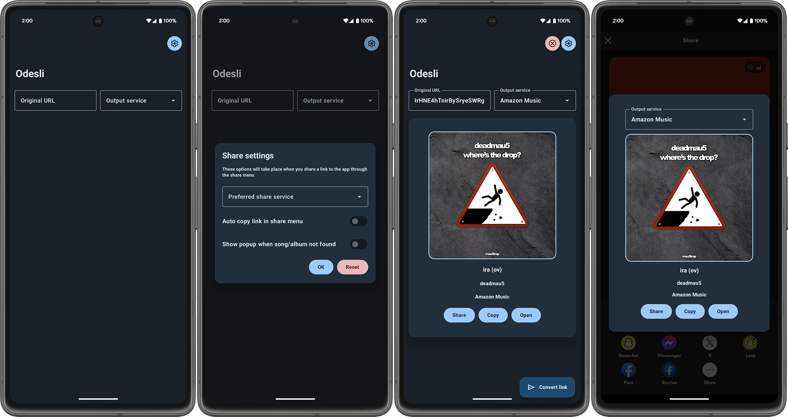

# odesli-android
 A simple app that uses the Odesli API to convert songs/albums to many streaming services\
 [Download](https://github.com/prochy-exe/odesli-android/releases/latest)

# Compatibility
 Thanks to the simplicity of this app, it supports all types of devices within the one APK.

# How does it work?
 This app uses the Odesli API to convert links to any streaming service of your choosing.\
 Generally speaking this conversion process lasts max 10 seconds.\
 The request to [Odesli API](https://odesli.co/) is sent using the [Retrofit library](https://github.com/square/retrofit), the [Coil library](https://coil-kt.github.io/coil/) is responsible for asynchronously rendering the song/album cover.\
 The Odesli API also has support for country codes to make sure the song or album you are trying to convert will be available for you. That means that the app has to figure out your country in some capacity, however as you might have noticed, I have decided to not ask for location directly and obtain the country code using other means which will be explained in the next paragraph.\
 This app is can be used in 2 major ways:
  * By copying and converting the link directly into the app
  * By sharing the link to the app\
   This option allows you to easily and quickly share the song/album you want to convert to another streaming service.\
   Behavior of this option is customizable via the settings
    * Preferred service\
    This service will be used when sharing a song or an album into the app
    * Auto-copy\
    This option will automatically copy the link into your clipboard without showing the UI
    * Show card when the song or album wasn't found on the preferred service\
    This option will allow you to pick a different service right away, otherwise a toast will be shown informing you that the preferred service doesn't have the song or album you are trying to convert 

# Obtaining your country code
 Instead of relying on your location which might feel unnecessary, and it totally is, I decide to use the TelephonyService, provided by Android, for devices with a SIM card, and other devices will make a request to [IPinfo](https://ipinfo.io), which is a 3rd party service that allows obtaining basic location information about you.\
  **!! I DO NOT GATHER THIS INFORMATION, IT'S BEING DIRECTLY PASSED TO THE ODESLI API !!**

# Screenshots

 
 
 Left to right:
 * Main UI
 * Settings popup
 * Main UI convert
 * Share UI

# Libraries/APIs used
 * [Odesli/Songlink](https://odesli.co/)
 * [Coil](https://coil-kt.github.io/coil/)
 * [Retrofit](https://github.com/square/retrofit)
 * [IPinfo](https://ipinfo.io)